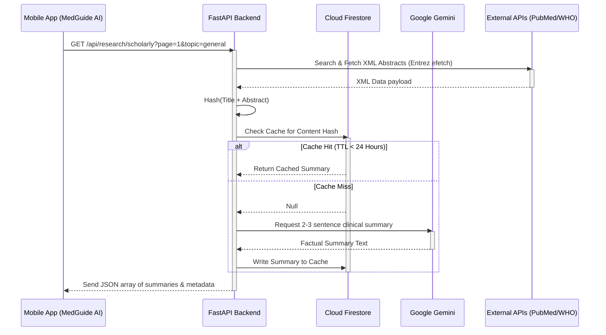

# MedGuide AI — Technical Blueprint & Data Flow Deconstruction

This document outlines the end-to-end data flow, network architecture, and data extraction mechanics for **MedGuide AI**. It deconstructs potential failure points in backend retrieval and frontend parsing to ensure robust production operations.

---

## 1. System Architecture Diagram

```mermaid
graph TD
    subgraph Mobile Client (Android Jetpack Compose)
        UI[Vertical Paging Feed Screen]
        Auth[Firebase Authentication / Local Bypass]
        Net[Retrofit Client]
        UI --> Net
    end

    subgraph Backend Services (FastAPI on Cloud Run)
        API[Main FastAPI App]
        LLM[Google Gemini 1.5 Flash]
        DB[(Cloud Firestore)]
        Anonymizer[PII/PHI Regex Scrubbing]
        
        Net -- HTTP Requests --> API
        API --> Anonymizer
        API --> LLM
        API --> DB
    end

    subgraph External Medical Databases
        PubMed[NCBI PubMed API]
        OpenAlex[OpenAlex Scholar API]
        WHO[WHO SEARO Guidelines API]
        DOHFW[DOHFW Guidelines API]
        
        API --> PubMed
        API --> OpenAlex
        API --> WHO
        API --> DOHFW
    end
```

---

## 2. Backend Data Extraction Flow (Step-by-Step)

The backend exposes two primary retrieval flows: **Academic Articles** (PubMed/OpenAlex) and **Medical Guidelines** (WHO/DOHFW).



---

## 3. Deconstruction of Extraction & Display Issues

If the mobile app displays a **Network Error** or **Empty Feed**, the issue typically originates in one of the following four areas:

### 🔍 Issue A: Strict Client-Side Deserialization (GSON / Kotlin)
* **The Symptom**: The backend returns a status `200 OK`, but the app shows a `Network Error`.
* **The Root Cause**: Kotlin data classes inside [FeedModels.kt](file:///d:/Antigravity/Project%20Directory/android/app/src/main/java/com/example/medicofeeds/data/model/FeedModels.kt) define fields (like `journal`, `year`, `authors`, `abstract`) as non-nullable `String`. If PubMed or OpenAlex return a null value for any of these, the JSON output contains `null`. The GSON parser fails to instantiate the Kotlin class due to null-safety constraints, throwing a deserialization exception and triggering the mobile network failure loop.
* **The Fix**: Make all metadata fields nullable or assign default values in Kotlin (e.g. `val journal: String? = null`).

### 🔑 Issue B: NCBI Entrez API Rate Limiting & Auth
* **The Symptom**: Backend logs display `502 Bad Gateway` or timeouts on PubMed fetch requests.
* **The Root Cause**: Without a valid `NCBI_API_KEY` or `ENTREZ_EMAIL`, NCBI limits requests to **3 per second** per IP. If multiple requests are made concurrently during paging, NCBI rejects the connection.
* **The Fix**: Register a valid NCBI key in `.env` and implement a fallback mechanism in `research.py` that catches Entrez exceptions and returns search results from **OpenAlex** instead of failing.

### 🌐 Issue C: Unstable Governmental API Endpoints (DOHFW)
* **The Symptom**: The Guidelines feed loads WHO guidelines but no DOHFW guidelines, or fails completely.
* **The Root Cause**: The DOHFW document API (`mohfw-dohfw.gov.in`) is frequently offline, rate-limited, or returns non-JSON pages (HTML error portals).
* **The Fix**: Protect the DOHFW scraper with independent try-catch blocks and supply curated offline fallback guidelines if both live APIs are unreachable.

### 🔒 Issue D: Cleartext Traffic Blocks
* **The Symptom**: The emulator compiles successfully but fails to fetch anything (immediate network error).
* **The Root Cause**: Android 9+ blocks unencrypted HTTP traffic by default. Connecting to `http://10.0.2.2:8000/` will fail silently unless cleartext is explicitly allowed.
* **The Fix**: We resolved this by registering `android:usesCleartextTraffic="true"` in the application tag of [AndroidManifest.xml](file:///d:/Antigravity/Project%20Directory/android/app/src/main/AndroidManifest.xml).

---

## 4. Remediation Steps (Code Improvements)

We will execute the following code improvements to fix these deconstructed issues:
1. **Frontend**: Update Kotlin models in `FeedModels.kt` to make all API metadata fields nullable to prevent GSON parsing crashes on null data.
2. **Backend**: Add a safety fallback in `research.py` so if PubMed fails (due to rate limiting or key issues), it gracefully logs the error and returns OpenAlex results rather than failing with an HTTP 502 error.
