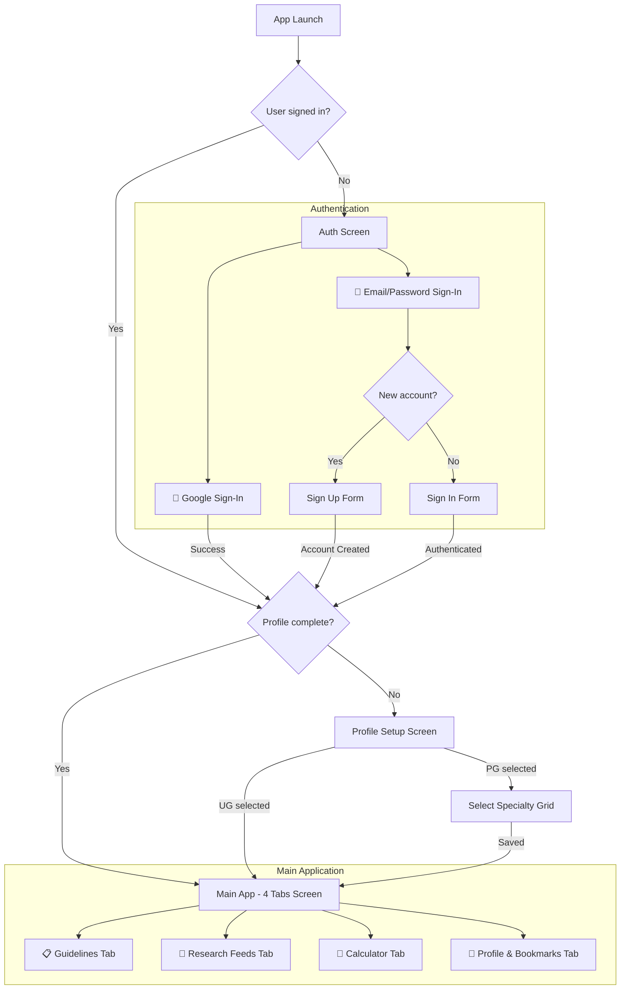

# MedGuide AI Companion — Product Specifications & Technical Blueprint

This document serves as the comprehensive product specification and technical deconstruction of **MedGuide AI Companion** (Clinical Guidelines, Research Feeds, and Deterministic Calculators). 

---

## 1. Product Concept & AI Product Management Philosophy

### Target User Persona
* **Busy Physicians & Residents (Postgraduates)**: Need instant access to the latest guidelines, clinical trials, and medical formulas in their specific specialty without browsing multiple disparate databases.
* **Medical Students (Undergraduates)**: Need broad, general clinical information and educational calculators (e.g., GCS, APGAR) to build clinical reasoning.

### Core Value Proposition
1. **Curated Personalization**: Feeds are automatically curated based on the physician's profile (UG vs. PG Specialty) and sorted chronologically (newest first).
2. **Zero-Hallucination Guardrails**:
   * **Calculators**: 100% deterministic, pure Kotlin formulas. Generative AI is strictly forbidden from doing math.
   * **Summaries**: Abstract summaries generated via Gemini/Gemma are checked against strict prompt constraints (no bolding, no bullet points, under 200 words, strictly factual, cached in Cloud Firestore for accuracy auditing).
3. **Robust In-App Experience**: In-app PDF reader (WebView with Google Docs GView viewer) avoids launching external browsers, maintaining focus.
4. **Persistent Bookmarks**: Saved feeds are cached locally using SharedPreferences and Gson serialization, ensuring complete offline availability to read in hospital wards.

---

## 2. Complete User Flow & Features



### Screen-by-Screen Feature Breakdown

#### A. Dual Authentication (Google + Email/Password)
* **Visual Presentation**: Dark Canvas aesthetic with a Slate Primary CTA and translucent Glass Overlay text inputs.
* **Google Sign-In**: Powered by Android Credential Manager API. Secure, single-tap authentication.
* **Email/Password Form**: Includes input fields for Email Address, Password, and Confirm Password (only visible during registration).
* **Validation**: Checks for valid email regex and minimum password length (6 characters). Compares password with confirm password in real-time, showing an inline error if they do not match.

#### B. Profile Setup (Personalization Engine)
* **Status Selector**: Choose between **Undergraduate (UG)** and **Postgraduate (PG)**.
* **Specialty Grid**: PG users select their specific branch from a list aligned with the National Medical Commission (NMC) India:
  * *MD (Clinical)*: General Medicine, Pediatrics, Dermatology, Psychiatry, Anesthesia, Radiology, Respiratory Medicine, Emergency Medicine, Family Medicine.
  * *MD (Para-Clinical)*: Pathology, Pharmacology, Microbiology, Community Medicine, Forensic Medicine.
  * *MS (Surgical)*: General Surgery, Ophthalmology, ENT, Orthopedics, Obstetrics & Gynecology.
* **Mapping**: Undergraduate status maps to the `"general"` topic query, returning a broad index of medicine and therapeutics clinical trials. Postgraduate status maps directly to their selected specialization query.

#### C. Home Navigation: The 4-Tab Layout
1. **Guidelines Tab (Default)**: Fetches official guidelines from DOHFW, WHO SEARO, and DGHS. Also crawls specific societies (like AAP, KDIGO, EULAR, ACOG) in parallel.
2. **Research Feeds Tab**: Lists latest clinical trials from PubMed and Google Scholar matching the user's profile topic, sorted newest-first.
3. **Calculator Tab**: Renders a grid of 8 essential deterministic medical calculators with visual score badges.
4. **Profile & Bookmarks Tab**: Displays user account information and a list of bookmarked articles stored locally for offline reading.

#### D. Smart Interactive Feed Card (UX Polish)
* **AI Clinical Summary**: Renders a crisp 200-word clinical summary (focused on diagnostic criteria, thresholds, and outcomes).
* **15s Read Tracking**: A `LaunchedEffect` detects if the user has viewed the active card for more than 15 seconds. If so, it triggers an background API call to `api/research/read`, adds the item ID to a local `_readIds` StateFlow, and immediately animates the card out of the active list.
* **Share Action**: Tapping the Share icon launches a native Android intent chooser (`Intent.ACTION_SEND`), allowing immediate sharing of the article title and URL via WhatsApp, email, Slack, or SMS.
* **Bookmark Action**: Tapping the Bookmark icon toggles its state (hollow/filled star). The article is serialized using `Gson` and stored in local `SharedPreferences` to ensure offline loading.
* **Read Full**: Launches a full-screen, fullscreen-overlay dialog containing a `WebView`. If the link is a PDF, it automatically prepends `https://docs.google.com/gview?embedded=true&url=` to render the PDF inline inside the app.

---

## 3. Medical Calculators Specifications

To fulfill the zero-hallucination mandate, all calculators are implemented with strict mathematical formulas and range boundaries:

| # | Calculator | Standard Formula | Interpretation & Safety Thresholds |
| :--- | :--- | :--- | :--- |
| 1 | **BMI** | \(\text{Weight (kg)} / \text{Height (m)}^2\) | Underweight (\(< 18.5\)), Normal (\(18.5 - 24.99\)), Overweight (\(25 - 29.9\)), Obese (\(\ge 30\)) |
| 2 | **BSA** | Mosteller: \(\sqrt{\frac{\text{Height (cm)} \times \text{Weight (kg)}}{3600}}\) | Normal range for adults is 1.6 - 1.9 \(m^2\). Used for chemotherapy dosing. |
| 3 | **eGFR (CKD-EPI 2021)** | \(142 \times \min(S_{cr}/\kappa, 1)^\alpha \times \max(S_{cr}/\kappa, 1)^{-1.200} \times 0.9938^{\text{Age}} \times [1.012 \text{ if Female}]\) | \(\kappa = 0.7\) (F), \(0.9\) (M); \(\alpha = -0.241\) (F), \(-0.302\) (M). CKD Stages: G1 (\(\ge 90\)), G2 (\(60-89\)), G3a (\(45-59\)), G3b (\(30-44\)), G4 (\(15-29\)), G5 (\(<15\)) |
| 4 | **Creatinine Clearance** | Cockcroft-Gault: \(\frac{(140 - \text{Age}) \times \text{Weight (kg)}}{72 \times S_{cr} \text{ (mg/dL)}} \times [0.85 \text{ if Female}]\) | Normal (\(\ge 90\)), Mild impairment (\(60-89\)), Moderate (\(30-59\)), Severe impairment (\(15-29\)), ESRD (\(<15\)). |
| 5 | **Corrected QT (Bazett)** | \(QT_c = \frac{QT \text{ (ms)}}{\sqrt{60 / HR \text{ (bpm)}}}\) | Normal (\(\le 450\) M, \(\le 460\) F), Borderline (\(450/460 - 500\)), Critically Prolonged (\(> 500\)). |
| 6 | **APGAR Score** | Sum of 5 parameters (Appearance, Pulse, Grimace, Activity, Respiration), scored 0, 1, or 2. | Normal (\(7-10\)), Moderately abnormal (\(4-6\)), Critically low (\(0-3\)). |
| 7 | **Glasgow Coma Scale** | Sum of Eye (1-4), Verbal (1-5), and Motor (1-6) responses. | Mild TBI (\(13-15\)), Moderate TBI (\(9-12\)), Severe TBI/Coma (\(3-8\)). |
| 8 | **Wells PE Score** | Sum of risk factors (DVT signs (+3.0), PE #1 Dx (+3.0), HR > 100 (+1.5), Immobilization (+1.5), Prior PE/DVT (+1.5), Hemoptysis (+1.0), Cancer (+1.0)). | PE Unlikely (\(\le 4.0\)), PE Likely (\(> 4.0\)). |

---

## 4. Backend Technical Architecture

### Tech Stack
* **API Engine**: FastAPI (Python 3.10+) running asynchronously under Uvicorn.
* **Deployment**: Cloud Run (Dockerized), scaling to zero to optimize costs.
* **Database**: Cloud Firestore for persistent caching, read lists, and bookmark synchronization.
* **LLM Engine**: Google Gemini 1.5 Flash (via `google-genai` SDK) with fallback configurations.

### Data Aggregation Engines (Adapters)
To aggregate guidelines and research from 12+ sources, the backend implements specialized HTTP adapters in parallel:
1. **PubMed API Adapter**: Uses BioPython `Entrez` to perform structured MeSH searches and batch fetch XML abstracts.
2. **DGHS Scraper**: Crawls the official Directorate General of Health Services website using `BeautifulSoup` to extract evidence-based guidelines for lung cancer and other technical policies directly.
3. **WHO SEARO Endpoint**: Interacts with the WHO Sitecore REST publications repository, filtering by Southeast Asia office ID.
4. **DOHFW API Adapter**: Fetches files from the Indian Ministry of Health and Family Welfare WordPress endpoint, resolving media attachment pages to isolate direct PDF URLs.
5. **EuropePMC API Queries**: Executes parallel requests to EULAR, KDIGO, AAP, ACOG, and NNF endpoints using EuropePMC's REST search API, parsing abstracts and DOIs.

### Caching Strategy & LLM Prompts
* **Double Caching**: Generated AI summaries are hashed `Hash(Title + Abstract)` and stored in Firestore. Subsequent requests load from cache instantly.
* **Gemini Summary Prompt**:
  ```
  You are a clinical AI assistant. Summarize this clinical paper/guideline in about 200 words (maximum 200 words). The summary must be crisp, precise, and highly readable for a busy physician.
  Format requirements:
  1. Start writing the summary immediately. Do not include any introductory remarks, metadata, thinking process, markdown bolding, or bullet points.
  2. Focus only on critical thresholds, patient criteria, and clinical findings.
  Title: {title}
  Abstract: {abstract}
  ```

---

## 5. Security & Verification Protocol

### Verification Achievements
* **Guideline Crawling**: Standing verification verified that all 12 guideline channels are fully online and return structured data in under 2 seconds.
* **DGHS Scraper**: Verified that Page 4 successfully retrieves DGHS Lung Cancer Treatment and Palliation guidelines with their original Government of India PDF links.
* **Compilation**: The Android Kotlin client compiles cleanly with **zero errors** (`BUILD SUCCESSFUL` achieved in 33 seconds).
* **Git Sync**: Code has been successfully pushed and is live at `https://github.com/vrahul7/medico-ai-companion.git`.
